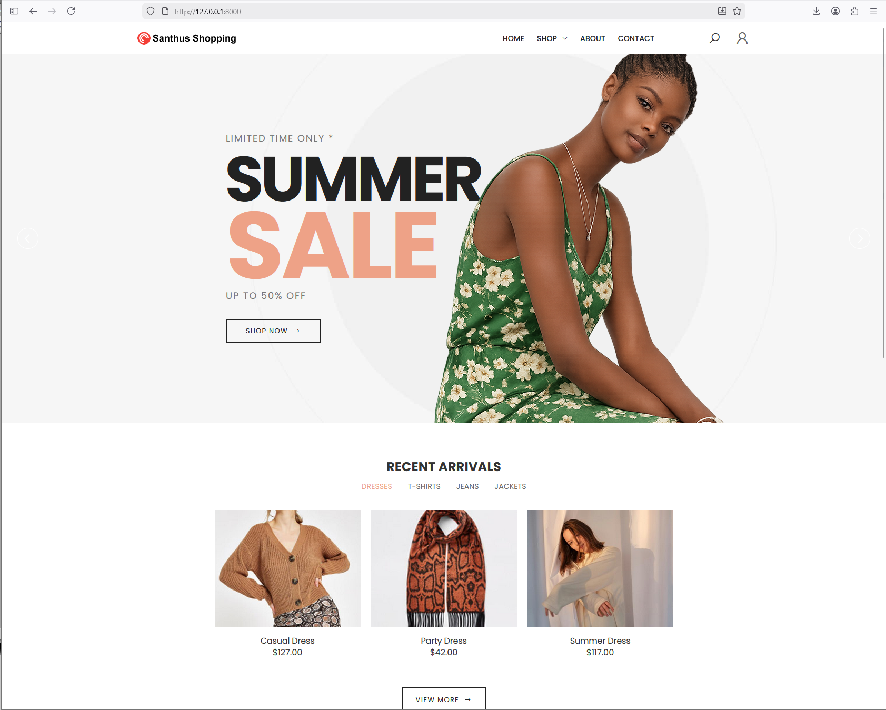
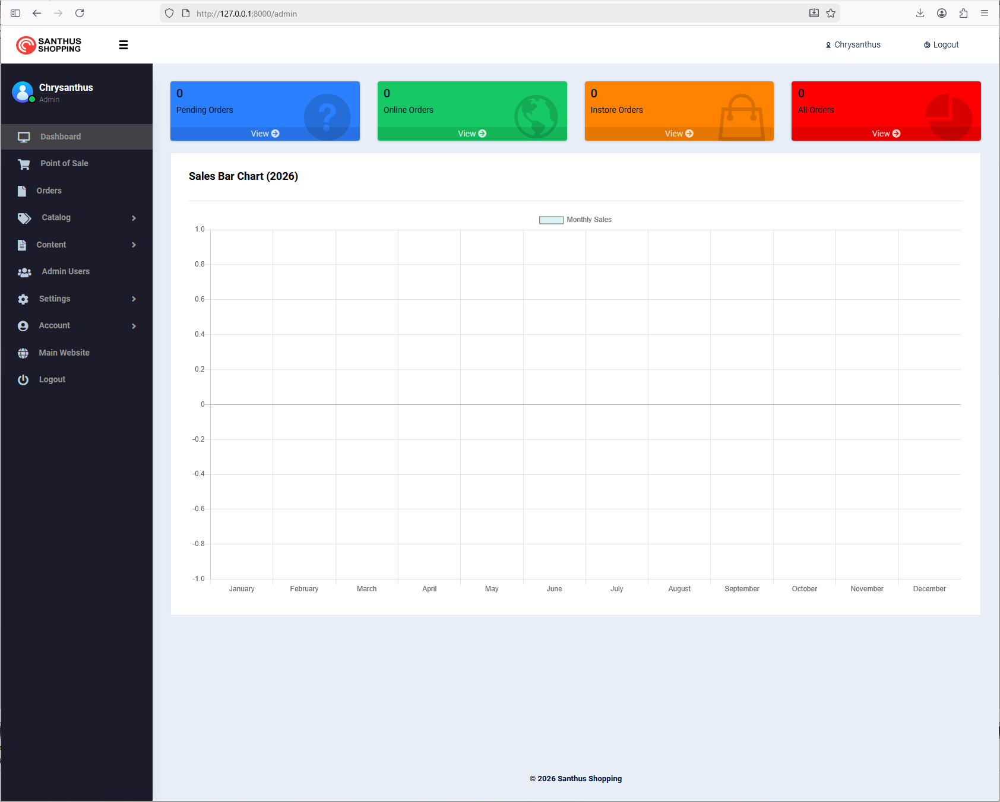

# Laravel E-commerce Website

## Overview
This project is a **Complete E-commerce Management System** built using Laravel. It provides comprehensive functionality for administrators to manage online store operations efficiently, including products, categories, orders, customer management, and business settings. For customers, the website serves as a full-featured e-commerce platform to browse products, add items to cart, place orders, and manage their accounts, making it easy to shop online from anywhere.

---

## Features
- **Product Management**: Admins can create, update, and delete products with detailed information including pricing, descriptions, categories, sizes, and images.
- **Category Management**: Organize products into hierarchical categories for better navigation and filtering.
- **Order Management**: Complete order processing system with payment integration, order tracking, and status management.
- **Customer Management**: User registration, authentication, profile management, and order history.
- **Shopping Cart**: Full-featured cart system with add, update, remove, and checkout functionality.
- **Payment Integration**: Stripe and Paystack payment gateway integration for secure online payments.
- **Contact Management**: Manage business contact information, including phone numbers, addresses, working hours, and social media handles.
- **Business Settings**: Configure country, currency, VAT rates, and delivery settings.
- **VAT System**: Automatic VAT calculation and display throughout checkout and order management.
- **Responsive Design**: The website is fully responsive, ensuring it works seamlessly on all devices.
- **Dynamic Content**: Admins can update information like products, categories, and business details dynamically.
- **Multi-currency Support**: Automatic currency symbol and code updates based on country settings.

---

## Demo
Check out the live demo of the project: [E-commerce Management System Demo](https://restaurant.chrys-online.com/)




---

## Security
Best practices are being employed in this project according to the latest Laravel 11 documentation. This includes proper data encryption and two-factor authentication to ensure the security and privacy of user data.

---

## Tools & Technologies Used
- **Laravel Framework**: PHP framework for building robust web applications.
- **MySQL**: Database for storing e-commerce data (products, orders, customers, categories, etc.).
- **AdminLTE 3**: For the admin dashboard interface ([AdminLTE 3 Dashboard](https://adminlte.io/themes/v3/)).
- **HTML5 & CSS3**: For building the front-end structure and design.
- **JavaScript & jQuery**: For interactive elements and dynamic behavior.
- **Bootstrap**: For responsive design and layout.
- **Templatemagic**: Portfolio template ([Portfolio by Templatemagic](https://themeforest.net/user/templatemagic/portfolio)).

---

## Libraries Used
This project utilizes the following libraries for enhanced functionality:  

- **[ezyang/htmlpurifier (4.18.0)](https://github.com/ezyang/htmlpurifier)**: Standards-compliant HTML filter written in PHP to ensure clean and secure HTML content.  
- **[intervention/image-laravel (1.3.0)](https://github.com/Intervention/image)**: Laravel integration of Intervention Image for image manipulation.  
- **[yajra/laravel-datatables-oracle (11.1.5)](https://yajrabox.com/docs/laravel-datatables/master)**: jQuery DataTables API for Laravel, simplifying server-side processing.  
- **[stripe/stripe-php (16.4.0)](https://github.com/stripe/stripe-php)**: Stripe PHP library for payment processing and integration.  
 
  

--- 
## How to Deploy On Shared Host Cpanel

[Deploy On Shared Host Cpanel ](DEPLOY.md)

## How to Run This Project on Your Local Machine
Follow these steps to set up and run the project locally:

### **Step 1: Clone the Repository**
```bash
git clone https://github.com/chrysanthusobinna/laravel-ecommerce.git
cd laravel-ecommerce
```

### **Step 2: Set Up the Environment**
1. Rename `.env.example` to `.env`:
   ```bash
   mv .env.example .env
   ```
 
### 2. Configure Your `.env` File  
Set up your `.env` file with the following configurations:  

#### **Database Connection**  
Define the database connection settings:  
```plaintext  
DB_CONNECTION=sqlite  
# DB_HOST=  
# DB_PORT=  
# DB_DATABASE=  
# DB_USERNAME=  
# DB_PASSWORD=  
```  

#### **Mail Configuration**  
Set up mail configurations:  
```plaintext  
MAIL_MAILER=log  
MAIL_HOST=1  
MAIL_PORT=  
MAIL_USERNAME=  
MAIL_PASSWORD=  
MAIL_ENCRYPTION=  
MAIL_FROM_ADDRESS=  
```  

#### **Stripe Configuration**  
Get your Stripe secret key and webhook secret from [Stripe](https://stripe.com/):  
```plaintext  
STRIPE_SECRET=your_stripe_secret_key_here
STRIPE_WEBHOOK_SECRET=your_webhook_secret_here
```  

#### **Google Maps API Key**  
Get your Google Maps API key from the [Google Cloud Console](https://console.cloud.google.com/):  
 

#### **Company Address**  
Set the company address here. Note that the address saved in the database will take precedence, and this will only serve as a fallback:  
```plaintext  
ADDRESS="Bradshawgate Bolton, BL1 1QD"  
```  

---

### **Step 3: Set Up the Database**
1. Create a new MySQL database (e.g., `ecommerce_db`).
2. Run migrations and seeders:
   ```bash
   php artisan migrate
   ```

### **Step 4: Start the Application**
Run the application on port 8000 or any port of your choice:
```bash
php artisan serve --port=8000
```
Visit the application at `http://127.0.0.1:8000`.

### **Step 5: Create an Admin User**
To create an admin user with global rights:
1. Edit the `UserSeeder` file located at `database/seeders/UserSeeder.php` and set the user details as desired.
2. Run the following command to seed the user:
   ```bash
   php artisan db:seed --class=UserSeeder
   ```
This user account will have global rights and can be used to create other user accounts.

---

## Credits
- **[BootstrapDash](https://github.com/BootstrapDash/celestialAdmin-free-admin-template)**: The admin dashboard celestialAdmin admin template
 design is powered by BootstrapDash, offering a modern and customizable interface.
- **[Templatemagic Portfolio](https://themeforest.net/user/templatemagic/portfolio)**: The front-end template for the website is inspired by Templatemagic's portfolio designs.

---

Feel free to fork this repository or contribute to its development by submitting a pull request! 

---
 
